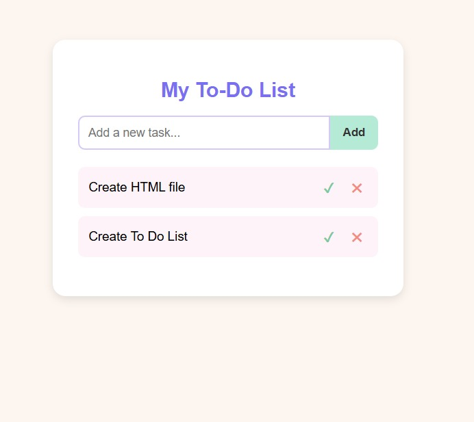

# 📝 My To-Do List

A simple, beginner-friendly To-Do List web app built using **HTML, CSS, and JavaScript** — no frameworks, no libraries, just the basics done cleanly.



## ✨ Features

- ➕ Add new tasks by typing and clicking **Add** or pressing **Enter**
- ✔️ Mark tasks as completed (adds a strikethrough)
- ✖️ Delete tasks you no longer need
- 🎨 Soft, light pastel color theme for a calm, friendly look
- 📱 Clean, minimal, responsive layout

## 🛠️ Built With

- **HTML5** – structure of the app
- **CSS3** – pastel styling, layout, and hover effects
- **JavaScript (Vanilla)** – task logic (add, complete, delete)

## 📂 Project Structure

```
├── index.html      # Main HTML file
├── style.css       # Pastel styling
├── script.js       # To-do list functionality
└── README.md       # Project documentation
```

## 🚀 Getting Started

1. Clone this repository
   ```bash
   git clone https://github.com/nayani8/todo-list.git
   ```
2. Open `index.html` in your browser — that's it! No build tools or installations required.

## 📸 Preview

A clean white card on a soft peach background, with a purple heading, a lavender-bordered input box, and a mint-green **Add** button.

## 🙌 Why This Project

This project was built as a beginner-friendly exercise to practice:
- DOM manipulation with vanilla JavaScript
- Creating and appending elements dynamically
- Basic event handling (`click`, `keypress`)
- Simple, aesthetically pleasing CSS design

## 📄 License

This project is open source and free to use for learning purposes.
